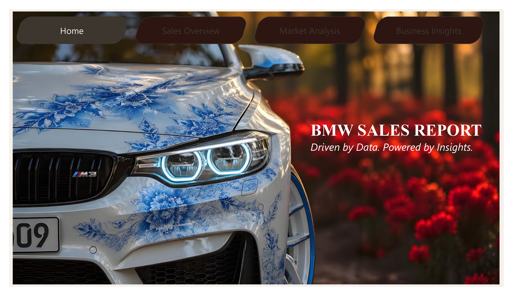
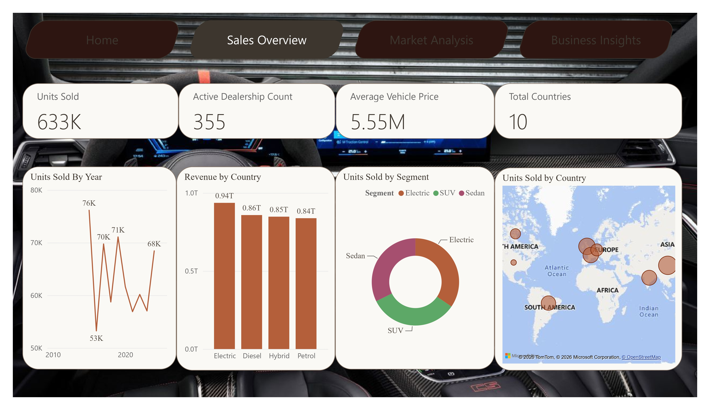
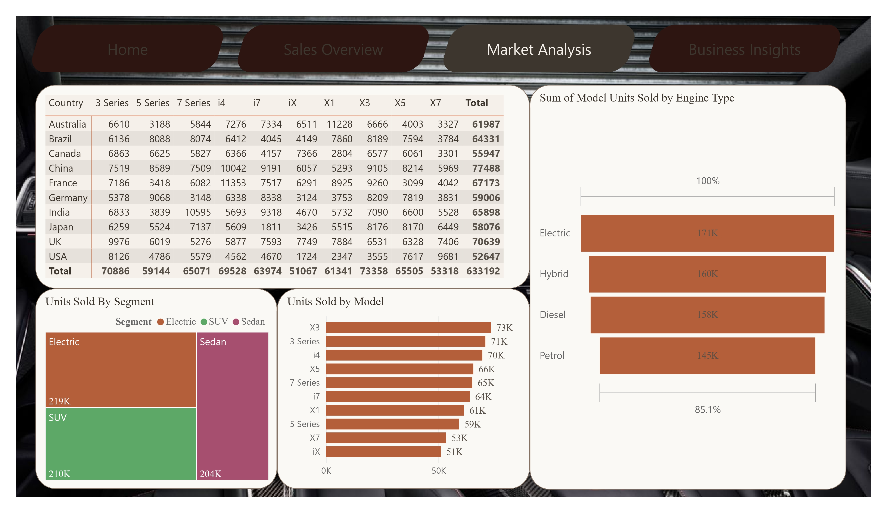
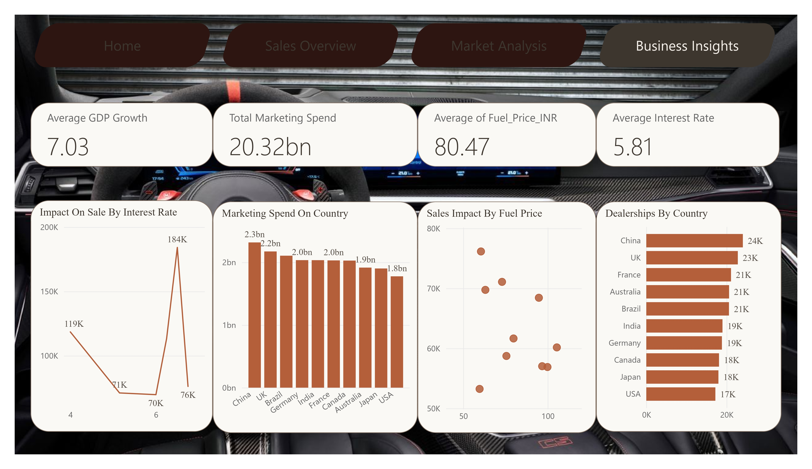

# 🏎️ BMW Global Sales & Market Analytics Dashboard

> **Driven by Data. Powered by Insights.**  
> An end-to-end executive analytical dashboard developed in **Power BI**, backed by custom SQL data analysis and macroeconomic correlation models across global markets.

---

## 📌 Executive Overview

This project provides a comprehensive business intelligence dashboard designed to evaluate global sales performance, market penetration, vehicle segment distributions, and macroeconomic factors influencing the **BMW Group**. 

By processing dataset metrics spanning multiple vehicle series (3 Series, 5 Series, 7 Series, i4, i7, iX, X1, X3, X5, X7) across key global territories (China, UK, France, India, Brazil, Australia, Germany, Japan, Canada, USA), the dashboard translates raw sales records into actionable business insights.

---

## 🛠️ Dashboard Architecture & Pages

The Power BI dashboard features a custom **BMW Motorsport cockpit-themed interface** with dynamic navigation buttons across four primary analytical views:

### 1. Home / Landing Page
The entry point introduces the analytical suite with custom BMW brand design assets and streamlined section routing.



---

### 2. Sales Overview Dashboard
Provides top-level KPI indicators and visual distributions of sales trends, vehicle engine revenue, segment proportions, and global geographical volume.



#### Key Performance Indicators (KPIs):
* **Total Units Sold:** 633K+ units (`633,192`)
* **Active Dealership Count:** 355 active dealerships tracked across regions
* **Average Vehicle Price:** ₹5.55 Million (`INR 5,554,855.72`)
* **Global Footprint:** 10 core international markets

---

### 3. Market & Model Analysis
Offers granular cross-tabular matrix analysis, model ranking comparisons, engine breakdown distribution, and segment treemaps.



---

### 4. Business & Macroeconomic Insights
Analyzes external economic drivers, marketing expenditures, interest rate correlations, and regional dealership networks.



---

## ⚡ SQL Data Queries & Analysis (`Query On bmw.sql`)

The repository includes a dedicated SQL script used for data validation, metric aggregation, and reporting layer preparation on the `bmw.bmw_data_csv` database table.

### 1. Total Units Sold by Engine Type
```sql
SELECT SUM(`MODEL UNITS SOLD`) AS `total units`, `Engine Type`
FROM bmw.bmw_data_csv
GROUP BY `Engine Type`;
```
| Engine Type | Total Units Sold |
| :--- | :--- |
| Electric | 170,694 |
| Hybrid | 159,624 |
| Diesel | 157,598 |
| Petrol | 145,276 |

---

### 2. Average Segment Price
```sql
SELECT ROUND(AVG(PRICE_INR), 0) AS `AVERAGE SEGMENT PRICE`, SEGMENT
FROM BMW.bmw_data_csv
GROUP BY SEGMENT;
```
| Segment | Average Segment Price (INR) |
| :--- | :--- |
| Sedan | ₹5,676,778 |
| Electric | ₹5,548,137 |
| SUV | ₹5,440,960 |

---

### 3. Average Competition Faced by Model
```sql
SELECT Model, AVG(`Competition by rivarly Index`) AS `Competition Index`
FROM bmw.bmw_data_csv
GROUP BY Model;
```
| Model | Competition Index |
| :--- | :--- |
| i4 | 5.99 |
| X3 | 5.82 |
| X1 | 5.69 |
| X5 | 5.65 |
| 7 Series | 5.58 |
| 3 Series | 5.57 |
| i7 | 5.57 |
| 5 Series | 5.50 |
| iX | 5.27 |
| X7 | 4.92 |

---

### 4. Units Sold by Country
```sql
SELECT Country, SUM(`MODEL UNITS SOLD`) AS `Units Sold`
FROM BMW.BMW_DATA_CSV
GROUP BY Country;
```
| Country | Units Sold |
| :--- | :--- |
| China | 77,488 |
| UK | 70,639 |
| France | 67,173 |
| India | 65,898 |
| Brazil | 64,331 |
| Australia | 61,987 |
| Germany | 59,006 |
| Japan | 58,076 |
| Canada | 55,947 |
| USA | 52,647 |

---

### 5. Average Price of Each Model
```sql
SELECT Model, ROUND(AVG(Price_INR), 0) AS `Average Price`
FROM BMW.BMW_DATA_CSV
GROUP BY Model;
```
| Model | Average Price (INR) |
| :--- | :--- |
| X1 | ₹5,746,337 |
| X7 | ₹5,730,733 |
| i4 | ₹5,599,638 |
| 7 Series | ₹5,583,278 |
| X5 | ₹5,573,869 |
| 3 Series | ₹5,540,822 |
| i7 | ₹5,494,211 |
| iX | ₹5,478,187 |
| X3 | ₹5,461,991 |
| 5 Series | ₹5,328,799 |

---

### 6. Year by Year Growth
```sql
SELECT Year, SUM(`MODEL UNITS SOLD`) AS `Units Sold`, ROUND(AVG(`ACTIVE DEALERSHIP COUNT`), 0) AS `Active Dealerships Per Year` 
FROM BMW.BMW_DATA_CSV
GROUP BY Year 
ORDER BY Year ASC;
```
| Year | Units Sold | Active Dealerships Per Year |
| :--- | :--- | :--- |
| 2015 | 76,157 | 203 |
| 2016 | 53,249 | 198 |
| 2017 | 69,755 | 208 |
| 2018 | 58,742 | 194 |
| 2019 | 71,089 | 212 |
| 2020 | 61,657 | 203 |
| 2021 | 56,899 | 193 |
| 2022 | 60,168 | 181 |
| 2023 | 57,036 | 195 |
| 2024 | 68,440 | 210 |

---

### 7. Sales by Segment
```sql
SELECT Segment, SUM(`MODEL UNITS SOLD`) AS `Units Per Segment`
FROM BMW.BMW_DATA_CSV
GROUP BY Segment
ORDER BY SUM(`MODEL UNITS SOLD`) ASC;
```
| Segment | Units Per Segment |
| :--- | :--- |
| Sedan | 204,430 |
| SUV | 209,953 |
| Electric | 218,809 |

---

## 📁 Repository Structure

```text
├── BMW_Data_csv.csv              # Source Dataset
├── Bmw Sales Report.pbix         # Power BI Desktop Report File
├── Query On bmw.sql              # SQL Queries Script
├── readme.md                     # Project Documentation
├── Bmw Sales Report_page-0001.jpg # Home Screen Screenshot
├── Bmw Sales Report_page-0002.jpg # Sales Overview Screenshot
├── Bmw Sales Report_page-0003.jpg # Market Analysis Screenshot
└── Bmw Sales Report_page-0004.jpg # Business Insights Screenshot
```

---

## 🤝 Contributing & License

Distributed under the **MIT License**.
